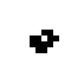
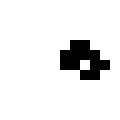
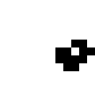

# Life

A Haskell implementation of Conway's Game of Life in a 2D matrix with periodic boundaries.

```
stack build
stack exec Life <ITERATIONS> <INTIAL_STATE_FILE> <OUTPUT_FOLDER>
```

- **ITERATIONS**: The amount of discrete iterations to perform on the initial state.
- **INITIAL_STATE_FILE**: Path to a `.png` file containing the initial state. The image must use *black* (exactly *#000000*) pixels to represent *alive* cells and other pixels (preferably *white*) to represent *dead* cells. The size of the initial state determines the size of the simulation.
- **OUTPUT_FOLDER**: The folder where the output images (also `.png`) are stored. The images are named by their generation (`0.png`, `1.png`, ...) where generation 0 is the initial state. If the directory does not exist
it will be created.

There are several example states in the `worlds` folder.

**Note**: The pictures use a single pixel to represent a cell. The rendered images will appear very small in some viewers/editors.

## Example

```
stack exec Life 5 worlds/lwss.png out
```









## License
MIT.
